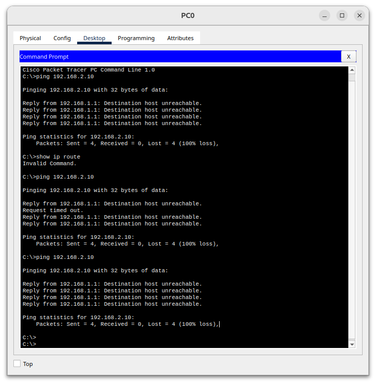
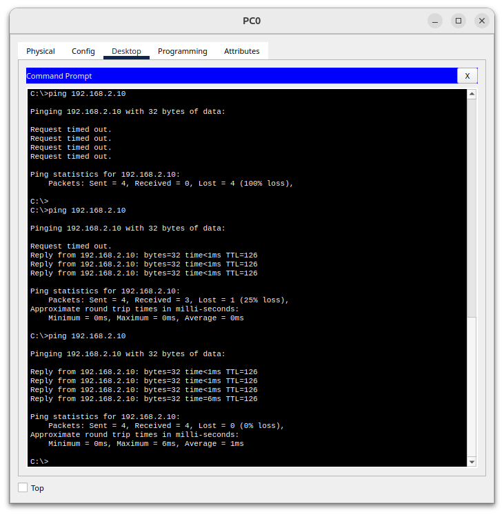
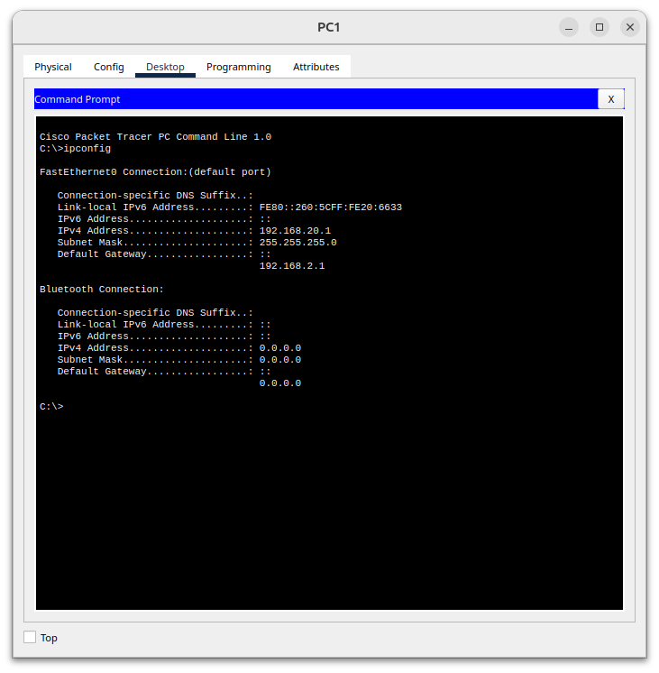

# Lab 2.5 — Roteamento Básico (rota estática)

**Abertura:** 2026-06-28
**Execução no Packet Tracer:** 2026-07-27 (virou a madrugada de 28/07)
**Fase:** Redes Fundamentos — **último lab do Mês 01**

> **Status:** operacional, **não fechado**. Confiança auto-reportada **2** ("entendi mais ou menos, preciso praticar"). Pelo critério de avanço, sobe pra 3 só após **refazer a topologia do zero sem roteiro** + reteste 24h + reteste 72h surpresa.

---

## Objetivo

Ver o pacote **não chegar** entre duas redes sem rota → adicionar **rota estática** → ver **chegar**. É o que separa "duas redes que existem" de "duas redes que se falam".

---

## Topologia montada

```
  Prédio A                    A ESTRADA /30                    Prédio B
 (192.168.1.0/24)            (10.0.0.0/30)                  (192.168.2.0/24)

  PC0 ───── [Gig0/0] R1 [Gig0/1] ─────── [Gig0/1] R2 [Gig0/0] ───── PC1
 .1.10        .1.1      10.0.0.1         10.0.0.2      .2.1        .2.10
   │            │                                        │           │
  gw=.1.1   portão A                                  portão B   gw=.2.1
```

| Dispositivo | Interface | IP | Máscara | Papel (analogia Correios) |
|---|---|---|---|---|
| PC0 | — | 192.168.1.10 | /24 | morador do bairro A |
| R1 | Gig0/0 | 192.168.1.1 | 255.255.255.0 | portão do bairro A |
| R1 | Gig0/1 | 10.0.0.1 | 255.255.255.252 | ponta da estrada (A) |
| R2 | Gig0/1 | 10.0.0.2 | 255.255.255.252 | ponta da estrada (B) |
| R2 | Gig0/0 | 192.168.2.1 | 255.255.255.0 | portão do bairro B |
| PC1 | — | 192.168.2.10 | /24 | morador do bairro B |

**Por que /30 na estrada?** Link ponto a ponto só tem duas pontas. `/30` = bloco 4 → rede `.0`, úteis `.1` e `.2`, broadcast `.3`. Encaixe exato. Usar /24 ali seria reservar 254 endereços pra um corredor onde cabem duas pessoas.

---

## Passo 1 — Físico primeiro

2 roteadores **2911** + 2 PCs, tudo com **Copper Straight-Through** (o PT tem auto-MDIX).

Aprendizado: as luzes ficaram **vermelhas** depois de cabear. **Cabo conectado ≠ interface funcionando** — são dois problemas diferentes. No roteador a interface vem `shutdown` de fábrica (ao contrário da porta de switch, que já vem ligada).

## Passo 2 — Endereçar as interfaces

```
enable
configure terminal
hostname R1
interface gig0/0
 ip address 192.168.1.1 255.255.255.0
 no shutdown
interface gig0/1
 ip address 10.0.0.1 255.255.255.252
 no shutdown
end
```

R2 igual, com IPs espelhados (`192.168.2.1` e `10.0.0.2`).

Validação:

```
R1#show ip interface brief
GigabitEthernet0/0     192.168.1.1     YES manual up                    up
GigabitEthernet0/1     10.0.0.1        YES manual up                    up
Vlan1                  unassigned      YES unset  administratively down down
```

`up  up` nas duas colunas = físico e camada 2 de pé. `Vlan1 administratively down` é a interface virtual do switch interno do 2911, sem uso aqui — ignorar.

## Passo 3 — Testar SEM rota (tem que falhar) 🔴



```
C:\>ping 192.168.2.10
Reply from 192.168.1.1: Destination host unreachable.
Packets: Sent = 4, Received = 0, Lost = 4 (100% loss)
```

**Falhou do jeito certo.** Quem respondeu foi o `192.168.1.1` — o próprio R1. Leitura da história:

1. PC0 viu que o destino não é do prédio dele → empurrou pro portão. **Gateway estava certo.**
2. R1 foi na tabela procurar `192.168.2.0` → **não achou**.
3. R1 não engoliu calado: devolveu **ICMP Destination Unreachable**. É o Lab 2.4 aparecendo vivo dentro do 2.5.

`show ip route` no R1 mostrava só rotas `C` e `L` — nenhuma linha `S`.

## Passo 4 — A rota estática ❤️

Em **R1**:
```
configure terminal
ip route 192.168.2.0 255.255.255.0 10.0.0.2
end
```
Em **R2** (a volta):
```
configure terminal
ip route 192.168.1.0 255.255.255.0 10.0.0.1
end
```

Resultado no R2:
```
S    192.168.1.0/24 [1/0] via 10.0.0.1
```

## Passo 5 — Testar COM rota 🟢



```
Reply from 192.168.2.10: bytes=32 time<1ms TTL=126
Packets: Sent = 4, Received = 4, Lost = 0 (0% loss)
```

Dois detalhes que valem tanto quanto o ping:

- **TTL=126.** Saiu com 128 (padrão), chegou com 126 → **dois roteadores decrementaram 1 cada**. É o "Lineu" do Lab 2.4 trabalhando, e é a prova independente de que o pacote atravessou R1 e R2.
- **Primeiro pacote deu timeout, os 3 seguintes responderam.** É o ARP — "primeiro dia de trabalho", o PC ainda não sabia o MAC do gateway. No ping seguinte, 4/4 limpos.

---

## Erros que cometi (e como diagnostiquei)

### 1. Rota digitada fora do modo de configuração

Primeira tentativa do `ip route` não entrou. Sintoma: `show ip route` sem nenhuma linha `S`.
**Causa:** comando digitado fora de `configure terminal`.
**Trava:** o **prompt é o indicador**. Se não está em `R1(config)#`, o comando de configuração não existe.

### 2. `show ip route` no PC

Rodei `show ip route` no Command Prompt do PC0 → `Invalid Command`.
**Causa:** comando de **IOS**, não de PC. A aba `CLI` só existe no roteador; o PC tem `Desktop`.

### 3. IP do PC1 digitado errado — `192.168.20.1` em vez de `192.168.2.10` ⚠️



Com as duas rotas corretas, o ping ainda dava **Request timed out**. Diagnostiquei sozinho pelo `ipconfig` do PC1: o IP estava `192.168.20.1`, fora da rede do bairro B.


**Esse erro é o meu padrão de inversão na transcrição.** Terceira ocorrência registrada (`8−256`, `64−256`, agora `20.1`) e a **primeira que sai do papel e vira configuração quebrada** — custou ~25 minutos. Trava nova: **conferir endereço octeto por octeto antes de aplicar.** A conta certa na cabeça e errada no papel é erro de verdade — num equipamento de produção, o que vale é o que foi digitado.

---

## A tabela de diagnóstico que resolveu o lab

O sintoma do ping diz **onde** está o problema:

| Sintoma | Significa | Onde mexer |
|---|---|---|
| `Destination host unreachable` vindo do gateway | o roteador **não tem a rota** | a **ida** — rota no R1 |
| `Request timed out` | a ida funcionou, a resposta se perdeu | a **volta** — rota no R2, ou o host de destino |

Foi seguindo essa tabela que os três erros caíram, um por um. **O sintoma mudou de `unreachable` pra `timed out` = progresso mensurável**, não tentativa e erro.

---

## Conceito central: conectividade ≠ conhecimento

A confusão que mais custou nesse lab (e que reincidiu duas vezes):

| | O que é | Onde se vê |
|---|---|---|
| **Conectividade** | o link físico está de pé | `show ip interface brief` → `up up`; linha `C` |
| **Conhecimento** | o roteador sabe **pra onde mandar** | `show ip route` → linha `S` |

A estrada `/30` **sempre esteve funcionando** — a linha `C 10.0.0.0/30 is directly connected` estava lá desde o Passo 2. A linha `S` não construiu estrada nenhuma: ela **ensinou o caminho**.

Analogia Correios: a estrada entre as duas agências existia, asfaltada, com caminhão em cima. O que faltava era o funcionário do R1 **saber que o bairro B existe e por qual estrada despachar**. A rota estática é a anotação no painel de triagem: *"carta pra 192.168.2.0/24? entrega pro colega em 10.0.0.2."*

**E por que o R2 não avisou sozinho?** Porque **roteador não fofoca**. Por padrão eles ficam calados — não trocam informação sobre as redes que conhecem. Um roteador só conhece de nascença o que está **plugado diretamente nele** (as linhas `C`). Pra ele, o mundo acaba na ponta da estrada. Só existem dois jeitos de aprender o resto:

1. **Escrever na mão** — rota estática, letra `S`. Foi o deste lab.
2. **Protocolo de roteamento** — as agências conversam e trocam a lista de bairros. Letras `O` (OSPF), `D` (EIGRP), `B` (BGP). **Mês 02.**

Com 2 roteadores, escrever na mão é trivial. Com 200, ninguém escreve 40 mil linhas — aí entra o dinâmico.

**Leitura das letras da tabela:** `C` = rede inteira do outro lado da porta · `L` = o IP específico do próprio roteador (/32) · `S` = estática, "tem a minha letra" · `via` = marca de que precisa de intermediário (rota conectada não tem `via`).

---

## Por que isso importa pra DevOps

"Rota errada / falta de rota" é a **causa nº 1** de "meu container/serviço não alcança o outro".

- **AWS:** *route table* de VPC é literalmente isso. Duas subnets não se falam até você escrever a rota. *VPC peering* = rota estática com outro nome.
- **Kubernetes:** pod não alcança serviço em outro nó → quase sempre rota/CNI, não a aplicação. `ip route` dentro do pod responde antes de qualquer log.
- **Datacenter:** cross-connect entre clientes, roteamento entre cages, link de trânsito — mesmo raciocínio em escala.
- **A pergunta de ouro:** quando um lado está de pé e mesmo assim não conecta, pergunte pela **volta**. Rota só de ida é o erro clássico.

**Espelho no Linux** (mesma frase, outra sintaxe):
```
sudo ip route add 192.168.2.0/24 via 10.0.0.2
```
"rede de destino **via** próximo salto" — idêntico ao IOS.

---

## Pendências pra fechar o lab

- [ ] Refazer a topologia **do zero, sem roteiro**, em ~15 min (a prática que falta pra confiança 3)
- [ ] Reteste 24h (fatual + relação + aplicação)
- [ ] Reteste 72h surpresa
- [ ] Post de LinkedIn com o print da topologia
- [ ] Passou nos dois retestes → **Lab 2.5 FECHADO = Mês 01 FECHADO** 🏁
